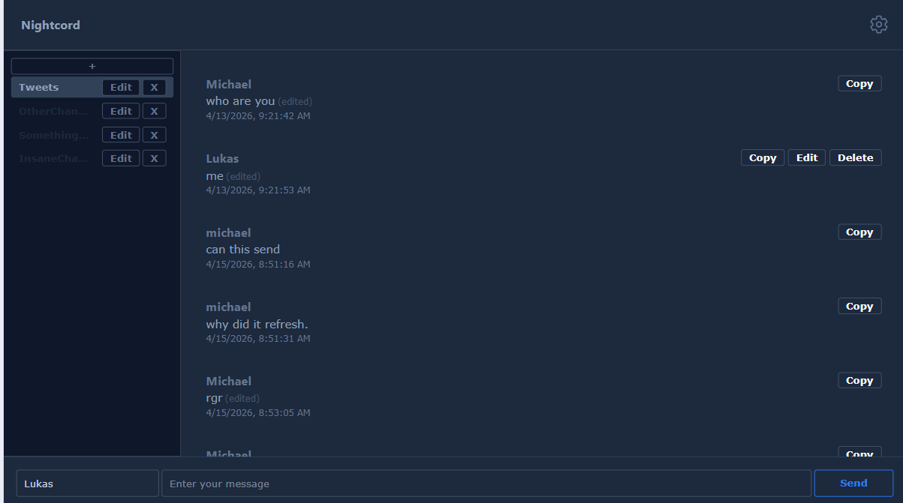

# Nightcord
Nightcord is a visualization of a database of a social messaging site where people send messages to the server.
Nightcord was based off of the CRUD server management and able to support countless features.
Features include:

+ Automatic fetching of messages
+ Sending messages to the server
+ Autoincrementing internal ID's in the backend
+ The editing of messages
+ No sign-up: complete anomymity.
+ Creating, Reading, Updating, and Deleting Channels.
+ Copy messages.
+ Responsive Design
+ Security against SQL Injection
+ Dark Mode
+ Permission to edit your own messages

To build, run ``chmod +x ./run_it.sh`` in the ``./server`` directory once, then write ``./run_it.sh`` for every subsequent running.
The HTML expects the server to be at "https://humble-space-disco-pjj7vvrw9j5r26v5r-8500.app.github.dev", you can edit line 4 of script.js to change whatever is serving your server.
If you are running this on your own computer, it might be at http://localhost:8500.

# Images
